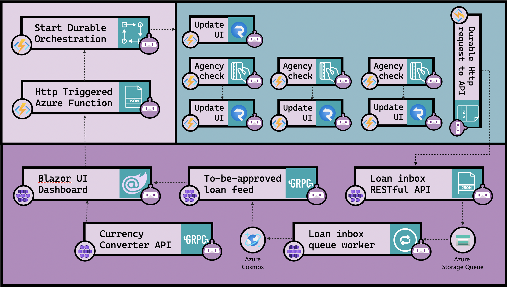
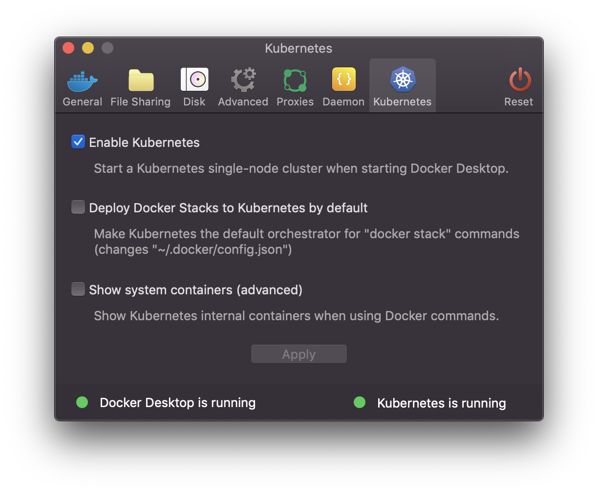

# Durable Loans Processing

This demo shows how .NET Core can be used to build cloud-native applications than run as microservices, or on serverles platforms, and that support a wide variety of communication patterns including SignalR for real-time communication and gRPC. 

## Project Structure

The solution consists of these projects, each of which serve an individual purpose. 

|Project |Purpose |
|---|---|
|DurableLoans.DomainModel   |A series of classes representing the ontology of the overall application.  |
|DurableLoans.ExchangeRateService   |gRPC service that provides currency exchange rate conversion.|
|DurableLoans.LoanOffice.Inbox      |REST API that receives requests from the Durable Function. The API sends the incoming loan applications into an Azure Storage Queue.|
|DurableLoans.LoanOffice.InboxProcessor      |Worker Service that wathces the inbox queue. When loan applications are dropped onto the queue by the inbox REST API, this project picks them up and saves them to Cosmos, in the `Inbox` container where they await human review.
|DurableLoans.LoanOffice.ToBeApproved   |Back-end service containing a gRPC endpoint that streams loans out to a client used by the loan officer to provide final approval of loan applications.|
|DurableLoans.LoanProcess   |The Azure Function that serves as the back-end for the system.|
|DurableLoans.Web   |The front-end web app.|

## Scenario overview

Customers submit loan applications via the front-end web app, which can run either as a microservices in Azure Kubernetes Service or in App Service. The loan application is sent to an Azure Durable Function, which orchestrates the steps in the pre-approval stage. Once the loan is pre-approved it is sent to a REST API microservice running in Azure Kubernetes Service. The message is queued onto an Azure Storage Queue, which is processed continuously by a .NET Core Worker service running either in Azure Container Instances or Azure Kubernetes Service. The Worker stores the loan application to an Azure Cosmos DB database, where it is held until the loan can be manually approved or declined. 

## Get it running locally

1. Configure the `DurableLoans.LoanProcess` project with the correct Azure SignalR Service and Azure Storage connection strings. 
1. `func start` the `DurableProcess.LoanProcess`.
1. `dotnet run` the `DurableLoans.ExchangeRateService` project.
1. `dotnet run` the `DurableLoans.LoanOffice.Inbox` project.
1. `dotnet run` the `DurableLoans.LoanOffice.InboxProcessor` project.
1. `dotnet run` the `DurableLoans.LoanOffice.ToBeApproved` project.
1. `dotnet run` the `DurableLoans.Web` project.

There is also a WPF app that demonstrates how to access the API from a desktop/WPF app. 

## Prerequisites

You won't need **all** of the items on the list, aside from those in **Absolutely Required** category. Beyond that, it will depend on your development approach which tools you'll enjoy the most. The idea is, most of the services have clients, and the more you need to do **with** each service, the more you'll benefit from having their tools. 

### Absolutely Required

* [.NET Core 3.0 SDK](https://dotnet.microsoft.com/download)
* [Azure CLI](https://docs.microsoft.com/en-us/cli/azure/install-azure-cli?view=azure-cli-latest)
* [Node.js](https://nodejs.org/en/download/) - Node is required by the Functions tools.
* [Azure Functions Tools](https://docs.microsoft.com/en-us/azure/azure-functions/functions-run-local) - For the most part you can get what you need for this by running `npm install -g azure-functions-core-tools@preview`. 
* [Visual Studio 2019](https://visualstudio.microsoft.com/)
* [Visual Studio Code](http://code.visualstudio.com/)
* [Docker](https://www.docker.com/products/docker-desktop) - Make sure you enable Kubernetes once you've installed Docker, as shown in the following screen shot. 

### Helpful Visual Studio Code extensions

These aren't required, but they will make life easier, especially if Visual Studio Code is your primary development environment. 

* [Docker](https://marketplace.visualstudio.com/items?itemName=ms-azuretools.vscode-docker)
* [API Management](https://marketplace.visualstudio.com/items?itemName=ms-azuretools.vscode-apimanagement)
* [Kubernetes](https://marketplace.visualstudio.com/items?itemName=ms-kubernetes-tools.vscode-kubernetes-tools)
* [Azure Storage](https://marketplace.visualstudio.com/items?itemName=ms-azuretools.vscode-azurestorage)
* [Azure Functions](https://marketplace.visualstudio.com/items?itemName=ms-azuretools.vscode-azurefunctions)
* [Azure Cosmos DB](https://marketplace.visualstudio.com/items?itemName=ms-azuretools.vscode-cosmosdb)
* [Azure CLI Tools](https://marketplace.visualstudio.com/items?itemName=ms-vscode.azurecli)
* [Azure App Service](https://marketplace.visualstudio.com/items?itemName=ms-azuretools.vscode-azureappservice)